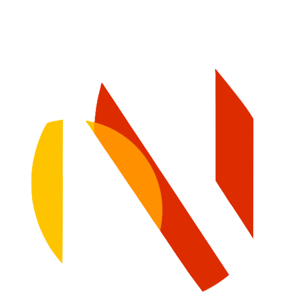

<p align="left">
  
</p>

# ForgeStack

ForgeStack is a fullstack template powered by **Next.js**, **Firebase**, and **Tailwind CSS**. It helps you quickly scaffold scalable web apps with built-in theming and Firebase integration.

## Features

- Next.js (App Router)
- Firebase Auth, Realtime DB, and Storage
- Tailwind CSS with dark mode support
- Custom hooks for Firebase services
- Clean, scalable project structure

## Getting Started

Create a new project:

```bash
npx create-forgestack my-app
cd my-app
```

## 🛠 Setup Firebase

After creating the project, you’ll be prompted to enter your Firebase configuration. Ensure you have a Firebase project set up and retrieve your API keys from the Firebase Console.

## 🚀 Running the Project

To start the development server, run:

```sh
npm run dev
```

This will launch your app at `http://localhost:3000`.

## 📂 Project Structure

```
my-app/
│── public/         # Static assets
│── src/
│   ├── components/ # Reusable UI components
│   ├── hooks/      # Custom Firebase hooks
│   ├── pages/      # Next.js pages
│   ├── styles/     # Global styles
│   ├── utils/      # Utility functions
│── .env.local      # Firebase credentials
│── package.json    # Dependencies & scripts
```

## 🎨 Theming

ForgeStack supports **light/dark mode** out of the box. You can customize the theme in `src/styles/globals.css`.

## 📜 License

This project is open-source and available under the **MIT License**.

## Contributing

Contributions are welcome! Feel free to fork the repo, submit issues, or make a pull request.

---

Built with ❤️ by the tmonga2208.
